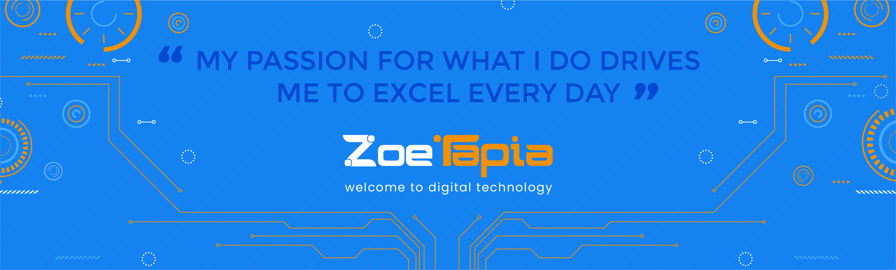

<h1 align="center">Hi, I'm LUIS TAPIA IGNACIO</h1>

  
  

  

## 👨🏻‍💻 About Me:

- 🙋‍♂️ All about me is at ****

- 🔭 I am currently working on 'Something Interesting'.

- 🌱 I am currently learning "MERN Stack"

- 👯 I am looking to collaborate for 'Development projects'

- 🔭 I am looking to belong to an international company

- 💬 You can contact me if you want

- ⚡ Fun fact: in my free time

- 📫 How to reach me **creactivahyo@gmail.com**

## 🛠️ Technologies and Tools I use:

                     

## ❤️ Let's get connected:

## 🤝 Support Me:

## 📊 My GitHub Data:

  
  

